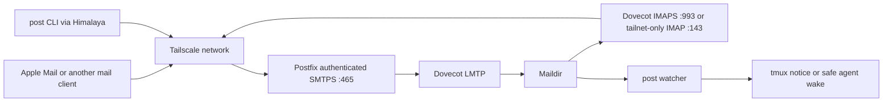

# Architecture and operations

UNIX MAIL REDUX gives humans and local coding agents one durable messaging
system. It uses ordinary email protocols and Maildir storage, with a small
project-aware command named `post`.

The current server is NixOS. Standard IMAP and SMTP clients work from any
tailnet device, including Apple Mail. The `post` package currently builds on
Linux x86_64, Linux ARM64, and macOS ARM64.

## Why these pieces

The command-line mail program underneath `post` is
[Himalaya](https://pimalaya.org/himalaya/). `post` is a LuaJIT adapter that
adds project identity, safe argument construction, human review before send,
JSON output, reply threading, and the delivery watcher. Postfix and Dovecot do
the long-established mail-server work rather than reimplementing SMTP, LMTP,
IMAP, authentication, folders, flags, or concurrent mailbox access.

The private mail domain defaults to `agents.home.arpa`. [RFC
8375](https://www.rfc-editor.org/rfc/rfc8375.html) reserves `home.arpa` for
names with local significance and says they are not globally unique. That
matches this system: these addresses exist inside one private network and
must not be routed on the public Internet. The actual server hostname remains
its Tailscale `*.ts.net` name.

## Data flow



One operating-system user owns the account. The human local part is delivered
to `INBOX`; other valid local parts become Dovecot detail folders such as
`Agents.validate`. A message to `validate@agents.home.arpa` and the command
`post --as validate list` therefore refer to the same mailbox.

Dovecot is the only process allowed to mutate mailbox state. The watcher reads
Maildir delivery metadata and persists its own notice state; it does not edit
messages.

## Use `post`

```bash
# Current project's mailbox; the Git root basename is inferred.
post list
post read 42

# Explicit mailbox or human inbox.
post --as validate list
post --as peter list

# Human-reviewed send and a threaded reply.
post to validate --as peter \
	--subject "Please pin the release" \
	--body "The candidate build passed."
post reply 42 --as validate --body "Pinned and verified."

# Machine-readable status.
post status --json
```

The candidate message is displayed before sending. Type `y` or `yes` to
approve it. `--yes` is available for a message already reviewed by another
mechanism. `post read` marks that message Seen after retrieval. The normal
Unix-mail shorthand is optional:

```bash
alias m=post
```

`post` accepts options before or after the verb. `--simple` removes decorated
output, and `--json` selects machine-readable output where the underlying
operation has structured results.

## Apple Mail and other graphical clients

Use the following preferred settings while Tailscale is connected:

| Setting | Value |
|---|---|
| Account type | IMAP |
| Email address | `<human-local-part>@agents.home.arpa` |
| Username | The configured NixOS owner |
| Password | Contents of the configured out-of-store password file |
| Incoming server | The server's Tailscale `*.ts.net` name |
| Incoming security | TLS, port 993 |
| Outgoing server | The same Tailscale name |
| Outgoing security | TLS, port 465 |
| Authentication | Password |
| IMAP path prefix | Blank |

An observed iPhone Mail version connected to port 993 without sending a TLS
ClientHello, leaving both sides waiting. This deployment retains a
compatibility path for that client:

| Setting | Compatibility value |
|---|---|
| Incoming SSL | Off |
| Incoming port | 143 |

Port 143 is admitted only on the configured Tailscale interface. Its IMAP
session is plaintext inside Tailscale's encrypted tunnel, so it must never be
opened on a LAN or public interface. Outgoing mail stays on authenticated TLS
port 465. [Apple documents](https://support.apple.com/guide/deployment/mail-declarative-configuration-dep2dae6c8eb/web)
its clients as supporting standards-based IMAP accounts.

## Agent notification behavior

The watcher maps a mailbox to exactly one live tmux pane by a unique project
directory basename or session name. Ambiguity causes no terminal input.

- An attached human client receives a tmux status notice. The watcher sends no
  input to that session.
- Mail bodies are never copied into an agent prompt. Any active wake uses a
  fixed program-generated sentence telling the agent to inspect its mailbox.
- Claude Code and Grok may be woken through a short-lived real tmux client only
  after the prompt and attachment gates pass.
- Codex 0.153.0 is currently passive-only. A live detached test found that its
  TUI could accept the wake text and then interrupt the conversation when the
  temporary client detached. `codex queue` accepted a queued message but did
  not start an idle turn in the tested local-writer topology. A native
  app-server start event remains under investigation.

The terminal protocol investigation and test design are documented in
[TMUX_WAKE.md](TMUX_WAKE.md).

## Trust and instruction authority

Tailscale authenticates devices and protects traffic between them. SMTP
authentication proves possession of this service's mailbox credential. The
current single-account design does not prove which person or local process
composed a message: an unrestricted process on the server can read the shared
credential, and `post --as` currently controls the visible From address.

Peter has explicitly accepted a temporary deployment policy under which mail
apparently from the configured human address is treated as his instruction,
subject to the same scope and safety constraints as an interactive prompt.
This is a stated risk decision, not cryptographic sender authentication.

The planned low-friction upgrade is S/MIME signing. Apple Mail supports signed
mail on iPhone, iPad, and Mac; [Apple's S/MIME
documentation](https://support.apple.com/en-gb/102245) describes installing an
identity certificate for the account. A private certification authority can
issue one certificate restricted to the human address. The server can then
verify the raw message, certificate chain, signed body, address binding,
validity period, and replay identifier before marking an instruction as
human-signed. PGP/MIME needs third-party Apple clients or plug-ins, while a
custom signed attachment loses the ordinary compose-and-send workflow.

The signing private key must remain off the agent host. An identity imported
only into Peter's Apple devices gives materially better separation than a key
stored on the NixOS server. Hardware-backed or offline signing remains a later
option. Until verification ships, the CLI and watcher must not label a message
as cryptographically verified.

## NixOS installation

Add the repository as a flake input and import its module:

```nix
{
	inputs.unix-mail-redux.url = "github:pmarreck/unix_mail_redux";

	outputs = inputs@{ self, nixpkgs, unix-mail-redux, ... }: {
		nixosConfigurations.mail-host = nixpkgs.lib.nixosSystem {
			system = "x86_64-linux";
			modules = [
				unix-mail-redux.nixosModules.default
				({ ... }: {
					services.tailscale.enable = true;
					services.unix-mail-redux = {
						enable = true;
						owner = "operator";
						humanLocalPart = "operator";
						tailscaleDomain = "mail-host.example-tailnet.ts.net";
						wakeProjects = [ "*" ];
					};
				})
			];
		};
	};
}
```

The module installs `post`, configures local-only Postfix delivery and Dovecot,
opens ports 143, 465, and 993 only on `tailscale0`, creates mutable state
outside the Nix store, obtains a Tailscale TLS certificate, and checks renewal
daily. `wakeProjects = [ ]` disables terminal wake authorization while keeping
delivery and notices; `enableWatcher = false` disables the watcher entirely.

The Tailscale account must permit `tailscale cert` for the configured MagicDNS
name. Build and inspect the target system before switching it according to the
host configuration's normal NixOS deployment procedure.

## State and secret locations

Defaults are shown here; module options can relocate the owner home or password
file where documented.

| Purpose | Path |
|---|---|
| Cleartext client credential, mode 0600 | `$HOME/.config/post/password` |
| Dovecot password hash | `/var/lib/unix-mail-redux/auth/users` |
| Maildir and folders | `/var/lib/unix-mail-redux/mail` |
| Tailscale certificate and private key | `/var/lib/unix-mail-redux/tls/` |
| Watcher receipts and cooldown state | `/var/lib/unix-mail-redux/watch/state.json` |
| Generated Himalaya configuration | `/etc/unix-mail-redux/himalaya.toml` |

The cleartext password and TLS private key never enter Git or the Nix store.
For backups, snapshot the mutable state directory at the filesystem level. If
snapshots are unavailable, quiesce Postfix and Dovecot before copying Maildir
so flags and deliveries cannot change mid-copy.

## Operations and diagnosis

```bash
# Mailboxes and service health.
post status
post status --json
systemctl status postfix dovecot unix-mail-redux-watch

# Recent delivery and watcher evidence.
journalctl -u postfix -u dovecot -u unix-mail-redux-watch --since today
systemctl show unix-mail-redux-watch -p ActiveState -p NRestarts

# Certificate renewal status.
systemctl status unix-mail-redux-tls.service unix-mail-redux-tls.timer

# Prove which interfaces own the mail listeners.
ss -ltnp | rg ':(143|465|993)\b'

# Run one watcher cycle without terminal wake input.
post watch --once --no-wake \
	--maildir /var/lib/unix-mail-redux/mail \
	--state-file "$TMPDIR/post-watch-diagnostic.json"
```

Common failures:

- A graphical client spins forever on IMAPS 993: confirm Tailscale first, then
  try the tailnet-only IMAP 143 compatibility settings above.
- Authentication fails after changing the password file: restart
  `unix-mail-redux-credentials.service`, then Dovecot and Postfix.
- Mail arrives but no agent reacts: check `post --as PROJECT list`, the watcher
  journal, exact tmux session/project uniqueness, attachment state, and whether
  the harness currently supports active wake.
- The watcher restarts: treat that as a defect. A human attachment or uncertain
  wake is a successful deferral and must not cause a restart loop.

## Tests and current boundary

Run the complete local suite through the flake's development environment:

```bash
nix develop -c ./test
nix flake check
```

The suite covers pure identity and wake decisions, shell-free process
arguments, CLI behavior, real tmux focus/attachment gates, Maildir state, Nix
module evaluation, and a NixOS VM that exercises authenticated SMTP submission,
LMTP delivery, IMAP retrieval, Seen flags, threading, Sent storage, plain IMAP
compatibility, and relay rejection.

Current limits are explicit recipient namespaces, a durable agent registry,
S/MIME verification, Markdown multipart composition, full delivery receipts,
and diagnostics/dead-letter reporting. They remain tracked in `PLAN.md` and
must not be described as shipped behavior.
